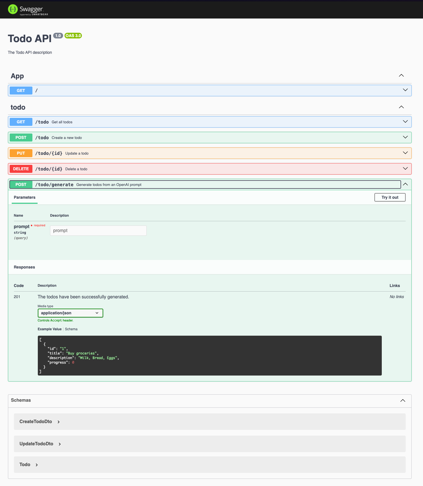

# My NestJS App

## Description

This is a basic NestJS application built with the Nest framework. It includes a simple TODO module for managing tasks and integrates with OpenAI to generate TODO items from prompts.

## Benefits

- **Scalable Architecture**: Built with NestJS, a progressive Node.js framework for building efficient and scalable server-side applications.
- **AI Integration**: Leverages OpenAI to generate TODO items from natural language prompts.
- **Validation and Security**: Includes input validation, rate limiting, and security best practices with Helmet.
- **Comprehensive Testing**: Equipped with unit and end-to-end tests to ensure reliability.
- **API Documentation**: Automatically generated Swagger documentation for easy API exploration.

## Installation

1. Clone the repository:
    ```bash
    git clone https://github.com/your-repo/my-nestjs-app.git
    cd my-nestjs-app
    ```

2. Install dependencies:
    ```bash
    npm install
    ```

3. Set up environment variables:
    ```bash
    cp sample.env .env
    # Update .env with your OpenAI API key and other configurations
    ```

## Running the app

### Development

```bash
npm run start:dev
```

### Production

```bash
npm run build
npm run start:prod
```

## Test

```bash
npm run test
```

## Lint

```bash
npm run lint
```

## Format

```bash
npm run format
```

## Tools Used

- **NestJS**: A progressive Node.js framework for building efficient and scalable server-side applications.
- **TypeScript**: A strongly typed programming language that builds on JavaScript.
- **Jest**: A delightful JavaScript testing framework with a focus on simplicity.
- **Prettier**: An opinionated code formatter.
- **Biome**: A tool for linting and formatting code.
- **Husky**: Git hooks made easy.
- **Supertest**: A library for testing Node.js HTTP servers.
- **ts-jest**: A Jest transformer for TypeScript.
- **ts-node**: TypeScript execution environment and REPL for Node.js.
- **tsconfig-paths**: Use TypeScript's path mapping in Node.js.
- **source-map-support**: Provides source map support for stack traces in Node.js.

## Api Overview



## Frontend Integration

This project is designed to work seamlessly with the frontend application available at [todo-react-ai-app](https://github.com/steckdev/todo-react-ai-app). The frontend provides a user-friendly interface for managing TODO items and interacting with the AI-generated tasks.

## Project Structure

```plaintext
src/
├── app.controller.ts
├── app.controller.spec.ts
├── app.module.ts
├── app.service.ts
├── main.ts
└── modules/
    └── todo/
        ├── todo.controller.ts
        ├── todo.dto.ts
        ├── todo.module.ts
        ├── todo.service.ts
    └── ai/
        ├── ai.service.ts
        ├── ai.service.spec.ts
        ├── ai.module.ts
        ├── ai.factory.ts
        ├── openai.provider.ts
```

## License

This project is licensed under the MIT License.